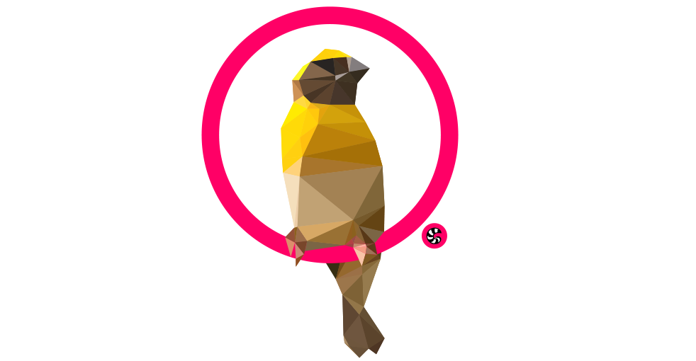

# Baya
A simple layout framework written in Swift.

## Features

- *Baya* encapsulates layout logic in structs.
- Build nested layouts without a nested view hierachy. 
- Write simple and readable layout code.
- It's extendable with your own layouts.
- Works without Interface Builder or Auto Layout.


## Installation

#### Carthage

Add the following to your `Cartfile`
```
github "getwagit/Baya" ~> 0.2.0
```

#### CocoaPods

Integrate Baya into your `Podfile`
```
pod 'Baya', '~> 0.2.0'
```

## Basic Usage
With *Baya* you first define your layout and then apply it. In most cases you want to define your layout once and apply it whenever the `frame` or content changes.
A basic layout in a `ViewController` could look like this:

```swift
...
var layout: BayaLayout?

override func loadView() {
  ...
  // Add views directly as sub views of the ViewControlles's root view.
  view.addSubView(profilePicture)
  ...

  // To create a layout call Baya's layout functions on a BayaLayoutable or an Array of BayaLayoutables.
  // A UIView is a BayaLayoutable by default.
  // In this example three simple UIViews are lined up horizontally.
  layout = [profilePicture, userName, friendCount].layoutLinearly(orientation: .horizontal)
}
```
Apply the layout by calling `startLayout(with:)`. A good place to do this in a `ViewController` is `viewWillLayoutSubviews()`.
```swift
override func viewWillLayoutSubviews() {
  // Apply the layout.
  layout?.startLayout(with: view.bounds)
}
```
You can use `BayaLayout`s to group `UIView`s and `BayaLayoutables` into tree-like layout structures. 
The layout of a simple `UIViewController` might look like this:
```swift
let buttonRowLayout = [button1, button2, button3]
  .layoutLinearly(
    orientation: .horizontal,
    spacing: 20)

let pictureLayout = profilePicture
  .layoutWithFixedSize(
    width: 100,
    height: 100)
  .layoutGravitating(to: .centerX)
  .layoutMatchingParentWidth()

let usernameLayout = nameLabel
  .layoutGravitating(to: .centerX)
  .layoutMatchingParentWidth()

layout = [pictureLayout, usernameLayout, buttonRowLayout]
  .layoutLinearly(orientation: .vertical)
  .layoutGravitating(
        horizontally: .centerX,
        vertically: .centerY)
  .layoutMatchingParent()
```

## Docs
Visit the [wiki](https://github.com/getwagit/Baya/wiki) for more information on the default layouts and how to use them.

## Contributing
Contributions are welcome! Please use the branch `develop` as base/target. If you modifiy the `project.pbxproj` file, use [xUnique](https://github.com/truebit/xUnique): `$ xunique -u -s -c Baya.xcodeproj`

## License 
Baya is available under the MIT license.


